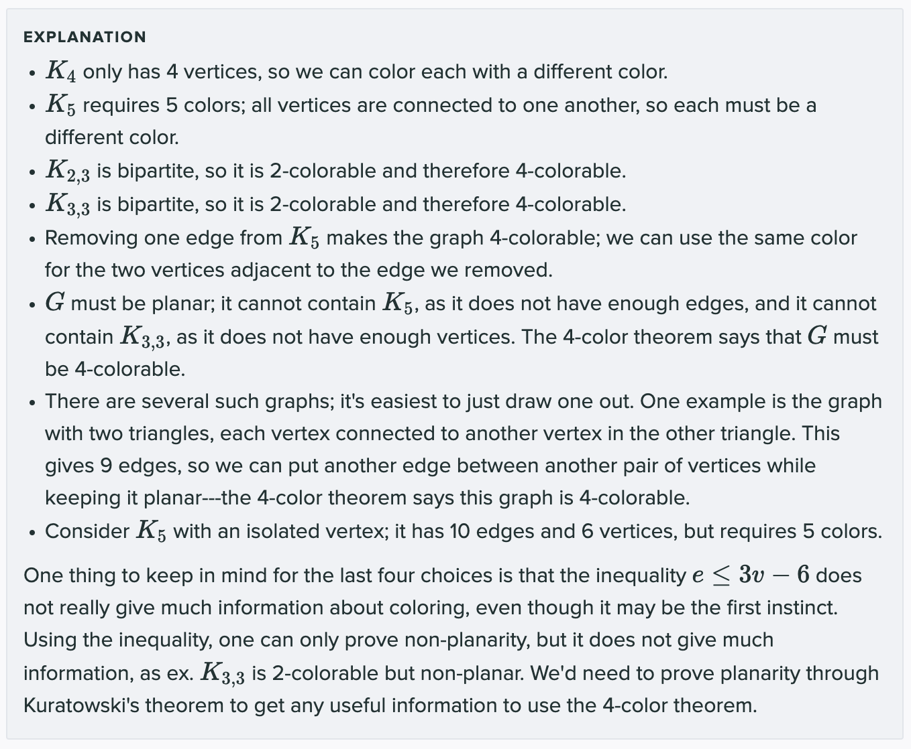

# Graph Questions I got wrong...

> Say I take a walk in any connected graph, making sure I only follow edges I haven’t followed before, and keep walking until there are no edges I haven’t followed incident to the the vertex I am in. If in the course of this walk I never see the same vertex twice then the degree of the vertex I get stuck at has
degree exactly one.

Answer: True. Since there is no cycle in the graph it is a simple path whose endpoints are degree 1.

---

> A graph with k edges and n vertices has a vertex of degree at least 2k/n.

Answer: True. The sum of degrees is 2k, there are n vertices. One is at least average

---

> If we remove one edge from Kn, the resulting graph can be vertex colored with n−1 colors.

Answer: True. Remove a vertex with degree n−2. If one has n−1 colors available, one can color it. Henceforth, there is always a vertex of degree n−2.

---

> For a graph with average degree k, more than half of the vertices must have degree at most k.

Answer: False. Consider K8 where every node has degree 7, then remove 6 edges from two vertices. 6 vertices have degree at least 5 since the form K6, the number of edges is 16 corresponding to an average degree of 32/8 of 4.

---

> Any connected graph with average degree strictly less than 2 is a tree.

Answer: True. It it is connected and has average degree less than 2 it must have |V|−1 edges exactly.
This means it is a tree.

---

> Any complete graph has a Hamiltonian tour. (Recall that a Hamiltonian tour is a cycle that visits every vertex exactly once.)

Answer: True. Any ordering of the vertices corresponds to a Hamiltonian tour as every edge is present

---

> If all vertices of an undirected graph have degree 4, the graph must be the complete graph on five vertices, K5.

False. K4,4 is a counterexample.

---

> The sum of the degrees of all the vertices on a graph with k edges and n vertices is 2n.

False. 2k is the correct sum: each edge contributes 2 to the total degree.

---

> All cycles are tours.

True. A cycle is a tour which doesn't repeat vertices.

---

> Removing a non leaf node and its incident edges disconnects a tree.

True. After the removal of v*, there will no longer be a path between v1, v2​. This satisfies the definition of a disconnected graph.

---

> It is possible to construct a connected graph G is connected that has |V| edges and no cycles.

False. If G is connected and has no cycles, it must be a tree and have |V| - 1 edges. Adding one more edge, would require a cycle exist in G.

---

> If a graph is 5-colorable, it must also be 4-colorable.

False. K5,5 is a counterexample. Remember K5,5 is degree 4.

> Select the true Statements.

K4 is 4-colorable **TRUE**  
K4 is 5-colorable **FALSE**  
K2, 3 is 4-colorable **TRUE**  
K3, 3 is 4-colorable **TRUE**  
Some graph G with 9 edges and 5 vertices is 4-colorable **True**  
Some graph G with 9 edges and 5 vertices is 4-colorable **False** 
Some graph G with 9 edges and 5 vertices is 4-colorable **True** 
Some graph G with 9 edges and 5 vertices is 4-colorable **True** 

Explanation:

---

> f(x) = ax (mod m) is a bijection if and only if m is prime.

False. It just needs gcd(a,m) = 1

---

> Consider a function f : A → B, where |A| = |B|. An inverse function for f is a function g : B → A
where ∀x ∈ A,(g(f(x)) = x∧ f(g(x)) = x). f(·) is a bijection if there is an inverse function.

True. The existence of the inverse suggests it is one-to-one and the fact that |A| = |B|
suggests it is onto.

---

> Any graph that is a simple cycle can be vertex colored with 2 colors.

False. Consider K3 or any cycle of lenth 2k + 1

---

> If there are n/2 leaves in an n-vertex tree, what is the average degree of the other n/2 vertices? (Assume
n is even.)

Total degree is 2(n − 1). The degree of those vertices is n/2, so remaining total degree is
2n−n/2−2, the average degree of the remaining n/2 vertices is thus 3−4/n.

---

> For a hypercube of dimension 4, how many edges (u, v) are there where u has a leading 0 and v has a leading 1?

8, The number of vertices in each cube is 8 and each has a mate in the other subcube.

---

> What is the longest simple cycle in a d-dimensional hypercube, for d > 1?

2d. They have a Hamiltonian cycle as proved in discussion.

---
